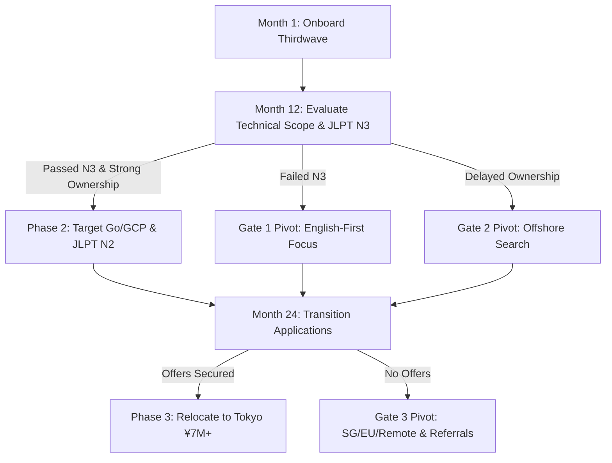

# Tokyo Tech Career Execution & Accountability Roadmap (3-Year Plan)

This roadmap is designed for **Jaiadithya A** (Incoming SDE @ Thirdwave, SASTRA University Class of 2026) to strategically transition to modern tech firms in Tokyo (such as Mercari, PayPay, or Microsoft) within 36 months, targeting a compensation of **¥7.0M+ JPY / ₹36L+ INR** by Year 3. It is built upon a quantitative analysis of 20 historical Indian engineer transitions and aligns directly with the profile in [AGENTS.md](file:///C:/Users/jaiad/Personal_Work_Related/.agents/AGENTS.md).

---

## 1. Evidence-Based Trajectory Mapping

An analysis of the 20 transition profiles in [transition_candidates.md](file:///c:/Users/jaiad/Personal_Work_Related/Personal%20Projects/Next_Move/transition_candidates.md) and salary trends in [salary_trends.md](file:///c:/Users/jaiad/Personal_Work_Related/Personal%20Projects/Next_Move/salary_trends.md) yields the following metrics:

### Quantitative Transition Metrics (n = 19 verified durations)
*   **Median Duration at Launchpad Firm:** **20 months** (1.67 years).
*   **Minimum Transition Velocity:** **1.2 years (14 months)**, achieved by Candidate #18 (Aravind Krishnan, NEC to Mercari) and Candidate #14 (Vamshi Teja, Rakuten to Atlassian).
*   **Maximum Transition Velocity:** **4.0 years (48 months)**, representing long-term tenure before transition.
*   **The "Dai-ni Shinsotsu" (Second New Graduate) Sweet Spot:** **89.5%** of candidates transitioned between **14 and 24 months**. This confirms that the prime recruitment window is after 1 to 2 years of professional experience, where modern tech firms hire for potential without requiring extensive senior-level architecture leadership.
*   **Top Transition Destinations:**
    *   **Mercari (Inc./India/US):** **10 / 20 candidates (50.0%)**. Mercari is the single largest consumer of transitioned talent in this dataset.
    *   **PayPay Corporation / PayPay Card:** **7 / 20 candidates (35.0%)**.
    *   *Combined Market Share:* Mercari and PayPay account for **85%** of all analyzed transitions, making them the primary targets.

### Target Companies & Technical Stacks
*   **Mercari, Inc.:** Primarily hires for **Go (Golang)** for backend microservices, **Python** (for ML/Search/Data), and **GCP (Google Cloud Platform)**. Additional profiles focus on iOS (Swift/SwiftUI) and MLOps/Kubernetes.
*   **PayPay / PayPay Card:** Heavy focus on **Java & Spring Boot** for core financial backend systems, **AWS (Amazon Web Services)**, and platform infrastructure automation (Docker, Kubernetes, Terraform).
*   **Other Tech Firms (Atlassian, Microsoft, LINE/LY Corp):** Split between Java/Spring Boot and Python/ML.

### The Strategic Role of JLPT (Japanese Language Proficiency Test)
While PayPay and Mercari brand themselves as English-first or global engineering organizations, the dataset reveals a clear competitive advantage for bilingual candidates:
*   **50.0%** of transitioned candidates explicitly hold a **JLPT N2 (4 candidates)** or **JLPT N3 (5 candidates, 1 N3/N4)** certification.
*   **JLPT N3 (Baseline Integration):** Demonstrates dedication to local integration. It is sufficient for pure development teams in PayPay or Mercari.
*   **JLPT N2 (Bilingual & Hybrid Roles):** Acts as a high-value transition accelerator. It opens backend SDE roles in hybrid/bilingual teams (such as LINE/LY Corporation, PayPay Card, and specific Mercari microservices teams) that coordinate with Japanese product managers.

---

### 🔍 Deep Dive: Mimicking the Candidate #18 Track
**Candidate #18 (Aravind Krishnan)** graduated from **SASTRA University (B.Tech CSE, 2021)**, joined **NEC Corporation (Software Engineer)**, and transitioned in **1.2 years (14 months)** to **Mercari, Inc. (Software Engineer, Backend)**.
Key stack: **Go, Python, Docker, GCP, JLPT N2**.

#### User-Specific Optimization Strategy
As a fellow **SASTRA CSE alum (Class of 2026)** joining Thirdwave as an incoming SDE, you are uniquely positioned to replicate and optimize this exact velocity:
1.  **Warm Alumni Connection:** Aravind is a direct SASTRA CSE senior. Connect with him on LinkedIn early.
    *   *Draft Connection Request:* *"Hi Aravind, I'm Jaiadithya, a fellow SASTRA CSE grad (2026) joining Thirdwave. I saw your impressive transition from NEC to Mercari Backend and would love to connect. I am targeting a similar path and would highly value your guidance on navigating the Tokyo tech landscape."*
2.  **Language Parity (Go):** Thirdwave may use Java, C++, or Python. You must independently master **Go (Golang)**, as it is Mercari's primary backend language.
3.  **Infrastructure Alignment:** Replicate Aravind's skills in containerization (**Docker**) and cloud services (**GCP**). Focus your showcase projects on cloud-native deployments.
4.  **Language Acceleration:** Achieve **JLPT N2**. NEC (Aravind's launchpad) and Thirdwave (your launchpad) provide the professional experience, but clearing N2 by Month 18 removes any linguistic barriers during the interview phase.

---

## 2. Risk-Adjusted Career Milestones (with Decision Gates)

### Phase 1 (Months 1–12): Onboarding, Technical Baseline & JLPT N3
*   **Happy Path (Ideal Track):**
    *   Successfully onboard at Thirdwave as an SDE. Establish a reputation for high-quality code delivery.
    *   Master core engineering practices: CI/CD pipelines, unit testing, and version control.
    *   Study and clear the **JLPT N3** exam (Target: **December 2026** exam window).
    *   Maintain LeetCode DSA consistency (target: 150 new Medium/Hard problems) and attend the **weekly LeetCode contests** to stay in top shape.
    *   Complete **AWS Certified Solutions Architect – Associate (SAA-C03)** by **December 31, 2026** (to target PayPay/modern architectures).
    *   Complete **AWS Certified Machine Learning – Associate (MLA-C01)** by **April 30, 2027** (to leverage your AI & Data Science specialization).
    *   Sanitize and publish showcase projects: [This-or-That](file:///c:/Users/jaiad/Personal_Work_Related/Personal%20Projects/This-or-That) and [student_wrapped_repo](file:///c:/Users/jaiad/Personal_Work_Related/Personal%20Projects/Data%20extraction%20project/student_wrapped_repo) (see Section 3).

*   **Decision Gates & Branching Logic (Optimistic Alignment):**
    *   **Gate 1 (Bilingual Track Unlock - Month 6/12):**
        *   `ON` clearing JLPT N3 by Month 12 (June 2027), officially activate hybrid/bilingual tech channels. In parallel, continue maintaining applications for English-first global engineering teams (PayPay core, Mercari global, Atlassian) to maximize your options.
    *   **Gate 2 (Technical Acceleration Check - Month 9):**
        *   `ON` completing AWS SAA-C03 certification by Month 9 (March 2027), immediately begin drafting cloud-native portfolio updates. If Thirdwave projects remain in legacy maintenance, leverage your AWS certification to begin applying for modern cloud SDE positions externally.

### Phase 2 (Months 13–24): Advanced Backend SDE, JLPT N2 & Transition Launch
*   **Happy Path (Ideal Track):**
    *   Take on design and architecture ownership at Thirdwave (e.g., database optimizations, caching implementation).
    *   Complete **Google Cloud Certified Associate Cloud Engineer (ACE)** by **October 31, 2027** (targeting Mercari's core GCP stack).
    *   Master **Go (Golang)** backend microservices.
    *   Study and clear the **JLPT N2** exam (Target: **December 2027** exam window).
    *   Actively practice mock interviews in system design and DSA (continuing weekly LeetCode contests).
    *   Initiate warm outreach to SASTRA alumni (Candidate #18 Aravind) and recruiters on LinkedIn/Tokyodev/Japan Dev by Month 18.
    *   Begin applying for SDE roles in Tokyo (target: Mercari, PayPay).

*   **Decision Gates & Branching Logic:**
    *   **Gate 3 (Transition Velocity Check - Month 18):**
        *   `IF` recruiter callback rates for Tokyo SDE roles are under 10% by Month 18, `THEN` shift showcase project architectures to include heavy containerization (Docker, Kubernetes) and serverless patterns, and rewrite resumes to highlight measurable business metrics (latency reductions, infrastructure cost savings).

### Phase 3 (Months 25–36): Interview Clearance, Relocation & Tokyo Integration
*   **Happy Path (Ideal Track):**
    *   Secure backend/ML SDE offers at Mercari, PayPay, or PayPay Card.
    *   Negotiate compensation packages to target a starting salary of **¥7.0M–¥7.5M JPY**.
    *   Process Japanese Certificate of Eligibility (CoE) and work visa.
    *   Relocate to Tokyo, onboard successfully, and scale within the new engineering organization.
    *   Begin Phase 4 planning (Growth to Senior SDE / Tech Lead).

*   **Decision Gates & Branching Logic:**
    *   **Gate 4 (Backup Market Check - Month 30):**
        *   `IF` Japanese visa processing or hiring freezes block Tokyo offers by Month 30, `THEN` expand search targets to Singapore-based tech hubs or remote-first European startups using the same backend/Go stack, while continuing local Indian SDE progression (targeting ₹20L+ INR base).

---

## 3. Concrete Daily, Weekly, and Monthly Syllabus

### DSA / LeetCode (Maintaining Top 2% Edge)
*   **Daily Load:** 1-2 Medium/Hard problems (focus on pattern mastery, not memorization).
*   **Monthly Target:** 20-25 solved problems.
*   **LeetCode Competition Requirements:**
    *   **Weekly Contest:** Attend every **Sunday at 8:00 AM – 9:30 AM IST**.
    *   **Biweekly Contest:** Attend every alternate **Saturday at 8:00 PM – 9:30 PM IST**.
    *   **Goal:** Simulate high-pressure environments, improve speed, and maintain/grow your current **Top 2% rating (target: 1900+ rating)**.
*   **Focus Areas by Month (Year 1):**
    *   *Month 1-3:* Array/String, Sliding Window, Two Pointers, HashMap/Set.
    *   *Month 4-6:* Linked Lists, Stacks, Queues, Binary Search, Trees, Graphs (BFS/DFS).
    *   *Month 7-9:* Recursion, Backtracking, Heaps, Greedy Algorithms.
    *   *Month 10-12:* Dynamic Programming (1D/2D), Tries, Bit Manipulation.

| Metric | Target | Minimum Floor |
| :--- | :--- | :--- |
| **Weekly Problem Count** | 5 Problems | 3 Problems |
| **Complexity Ratio** | 70% Medium / 30% Hard | 80% Medium / 20% Hard |
| **Contest Participation** | 1 Contest per week | 2 Contests per month |

---

### Cloud & AI Certification Track
To build verified credentials matching Tokyo tech stacks, you must complete the following path:

| Certification | Focus Stack | Preparation Resources | Registration Deadline | Exam Target Date |
| :--- | :--- | :--- | :--- | :--- |
| **AWS Certified Solutions Architect – Associate (SAA-C03)** | PayPay Backend / AWS Foundations | Stephane Maarek (Udemy), Adrian Cantrill, Tutorial Dojo Practice Exams | September 30, 2026 | **December 15, 2026** |
| **AWS Certified Machine Learning – Associate (MLA-C01)** | AI/ML Integration & Data Pipelines | AWS Skill Builder, Jon Bonso Practice Tests | February 28, 2027 | **April 15, 2027** |
| **Google Cloud Associate Cloud Engineer (ACE)** | Mercari Backend / GCP Microservices | Google Cloud Skills Boost, Dan Sullivan (Udemy) | August 31, 2027 | **October 15, 2027** |

---

### System Design Curriculum
Focus on scale, reliability, and low latency.
*   **Weekly Study Allocation:** 4 hours.
*   **Key Topics & Schedule:**
    *   *Month 1-3 (Fundamentals):* Read *Designing Data-Intensive Applications (DDIA)* Chapters 1-4. Study Load Balancers, DNS, CDNs, and API Gateways.
    *   *Month 4-6 (Caching & Queues):* Caching strategies (Cache-aside, Write-through, Write-behind using Redis). Message Queues (Kafka vs. RabbitMQ) for event-driven decoupled services.
    *   *Month 7-9 (Databases & Scaling):* Relational vs. NoSQL, Database partitioning/sharding, replication lags, CAP Theorem, ACID properties, and eventual consistency.
    *   *Month 10-12 (Applied Architectures):* Walkthrough standard system design cases (TinyURL, Ticketmaster, Uber, Chat System, Search Indexer).

---

### Bilingual Skills (Japanese Language Program)
*   **Daily Routine:**
    *   **Anki Flashcards:** 15 new vocabulary cards, review 50-80 due cards (use Core 2k/6k decks).
    *   **Shadowing/Listening:** 15 minutes of Japanese podcast (e.g., *Nihongo con Teppei*) or NHK Web Easy news articles.
*   **Weekly Routine:**
    *   1 hour of structured conversational practice (shadowing, or iTalki/HelloTalk sessions).
*   **Key Milestones:**
    *   **September 2026:** Register for JLPT N3.
    *   **December 2026:** Take JLPT N3 Exam.
    *   **September 2027:** Register for JLPT N2.
    *   **December 2027:** Take JLPT N2 Exam.

---

### Showcase Projects Sanitization & Publishing Guide

To transform your local projects into recruitment magnets on GitHub, execute the following sanitization and polishing steps:

#### Project 1: [This-or-That (Celebrity Edition)](file:///c:/Users/jaiad/Personal_Work_Related/Personal%20Projects/This-or-That)
*   **Tech Stack:** React 19, Vite, Tailwind CSS v4, Framer Motion, Upstash Redis, Vercel Serverless Functions.
*   **Sanitization Steps:**
    1.  **Credential Isolation:** Ensure no API keys or database tokens (Upstash URL/token, Serper API key) are hardcoded. Run `git rm -r --cached` on any committed `.env` files and add `.env` to the [.gitignore](file:///c:/Users/jaiad/Personal_Work_Related/Personal%20Projects/This-or-That/.gitignore).
    2.  **Dependency Alignment:** Ensure `package.json` dependencies are stable. Set up clear scripts for frontend building and serverless API execution.
    3.  **Vercel Configuration:** Confirm the [vercel.json](file:///c:/Users/jaiad/Personal_Work_Related/Personal%20Projects/This-or-That/vercel.json) correctly configures rewrite rules for the `/api` directory.
    4.  **Professional README:** Highlight the technical architecture, specifically:
        *   **Serverless-Native Caching:** Explain the choice of Upstash Redis (REST) to prevent TCP exhaustion on serverless environments.
        *   **Parallel Validation Pipeline:** Describe the concurrent 2.5s HTTP ping filter used to validate image URLs before database caching.
        *   **Elimination Tournament Logic:** Detail the algorithmic design of the bracket-style tournament pool.

#### Project 2: [SASTRA UG Wrapped](file:///c:/Users/jaiad/Personal_Work_Related/Personal%20Projects/Data%20extraction%20project/student_wrapped_repo)
*   **Tech Stack:** Next.js (TypeScript), Python (Selenium scraper), ddddocr, SQLite.
*   **Sanitization Steps:**
    1.  **PII Removal (Critical):** The academic database contains sensitive student records (CGPAs, photos, fees, names). **Do not commit** the SQLite database (`.db` files), `Main Photos/`, or `students_data.json` / `students_index.json` containing real student details to a public GitHub. Add these paths to the [.gitignore](file:///c:/Users/jaiad/Personal_Work_Related/Personal%20Projects/Data%20extraction%20project/student_wrapped_repo/.gitignore).
    2.  **Generate Synthetic Mock Data:** Write a Python script (`generate_mock_dataset.py`) to generate synthetic, anonymized student records. This allows users of your public repository to run the app locally with mock data (e.g. "Alice", "Bob") and synthetic grade distributions.
    3.  **Scraper Decoupling:** The university portal scraper uses CAPTCHA solvers (`ddddocr`) and mimics portal API flows. Keep the scraper codebase private. For the public showcase repo, replace the scraper with a mock scraper class that simulates scraping latency and returns static mock profiles.
    4.  **Technical Showcase:** Highlight the Next.js optimization details:
        *   **Dynamic Data Imports:** Explain how the frontend maintains high performance using `O(1)` index-based lazy loading of JSON fragments, avoiding massive initial payload size.
        *   **State Management:** Describe the scroll-animated slide layouts built using Framer Motion or custom CSS animations.

---

## 4. Accountability & Feedback Loop Framework

### Weekly Self-Audit Protocol
To maintain execution discipline, self-report these four metrics every **Sunday night**:

1.  **LeetCode Weekly Count:** Target = 5 problems (Minimum Floor = 3).
2.  **LeetCode Contest Attended:** Target = 1 Contest (Weekly or Biweekly) attended and analyzed.
3.  **Study Hours:** Target = 10 hours total (4h System Design + 4h Japanese + 2h Cloud Certification Prep).
4.  **GitHub Commits & Cert Progress:** Target = 2 portfolio commits OR 3 modules of Cloud certification prep.

### Monthly Adjustment Rules
If life or workload disrupts your roadmap, use these protocols to recover without burning out:

*   **Rule 1: The 3-Strike Rule (Load-Halving Recovery)**
    *   `IF` any weekly target is missed **3 times in a row**, `THEN` execute a 1-week recovery cycle. Reduce LeetCode target by **50%** and focus exclusively on core work tasks and sleep to rebuild momentum. Do not attempt to "double the load" the following week.
*   **Rule 2: The Language Pivot**
    *   `IF` Japanese practice drops below 2 hours in a week, `THEN` automatically shift 2 hours from DSA/LeetCode to Japanese the next week. Language proficiency is the primary differentiator for bilingual positions.
*   **Rule 3: Workload Scaling**
    *   `IF` Thirdwave project deliveries require >45 hours/week, `THEN` scale study targets to focus exclusively on **high-yield** topics (System Design and conversational Japanese) and freeze DSA practice, relying on your existing 500+ LeetCode baseline.

---

### 📊 Weekly Self-Audit Dashboard Template

Copy this markdown table to track your weekly progress:

| Week Ending | LeetCode Solved (Target: 5) | LeetCode Contest (Target: 1) | Study Hours (Target: 10) | Git Commits / Cert Prep | Notes / Adjustments Applied | Status (Pass/Fail) |
| :--- | :---: | :---: | :---: | :---: | :--- | :---: |
| **June 28, 2026** |  |  | 1.0 |  | AWS ml prep |  |
| **July 5, 2026** |  |  |  |  |  |  |
| **July 12, 2026** |  |  |  |  |  |  |
| **July 19, 2026** |  |  |  |  |  |  |
| **July 26, 2026** |  |  |  |  |  |  |
| **Aug 2, 2026** |  |  |  |  |  |  |

---

### Actionable Next Steps (Next 14 Days)
1.  **LinkedIn Connection:** Search for and send a connection request to [Aravind Krishnan](https://jp.linkedin.com/in/aravind-krishnan-996b861b5) (Candidate #18).
2.  **Showcase Project Initial Setup:**
    *   Create a clean, empty public GitHub repository for *This-or-That*.
    *   Configure environment variables locally and update the project's `.gitignore` to prevent secret leaks.
3.  **Anki Deck Setup:** Download the Anki app and import the *JLPT N3 Kanji/Vocab* deck to begin daily reviews.